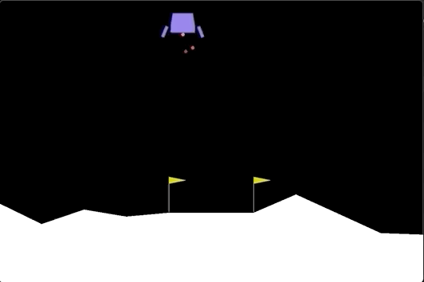

# Deep Q-learning (DQN) models.
In this repository we will implement the DQN models along with the latest extensions and improvements 
that have been added to them through the research community. 
The main objective is to provide an step by step and easy to follow Deep Q Learning tutorial with clean and readable code.

The following models have been implemented: 
1. Base Deep Q-learning (DQN)
2. Deep Reinforcement Learning with Double Q-learning 
3. Dueling Network Architectures for Deep Reinforcement Learning 
4. N-step Deep Q-Learning

## Implementation details
### Epsilon Greedy
The epsilon greedy is implement in its own class and supports two decay mode.
- Linear
- Exponential. 
The default is exponential and can bet set through the class constructor argument. Next figure shows the decay trend for each of the mentioned modes.

**Epsilon decay modes**


### Notebooks
All the models are also provided in Jupyter notebooks to for quick run on Google colab GPU accelerated environment.


### Examples

Example folder provides the solution for some of the classic Reinforcement environments.
The weights of the trained networks are also provided in the example folder. To play an animation of the trained agent 
pass the provided`.dat` file to the session instance of the same game. For example to play the LunarLander agent you must perform the following steps:

```shell script
$cd examples/DQN/
```
Open `Open the lunarlander_v2-dqn-n-step.py ` file in your favorite text editor:
Provide the name of the save file 


The provided solutions are as follows:

**LunarLander-v2**
If you encountered `'gym.envs.box2d' has no attribute 'LunarLander'` do the following:
```shell script
pip3 install box2d-py gym[box2d]
```
The environment considered to be solve with score of 200 or higher. It generally converges in about 400 episodes.

**Reward trend**


Trained agent Landing:


